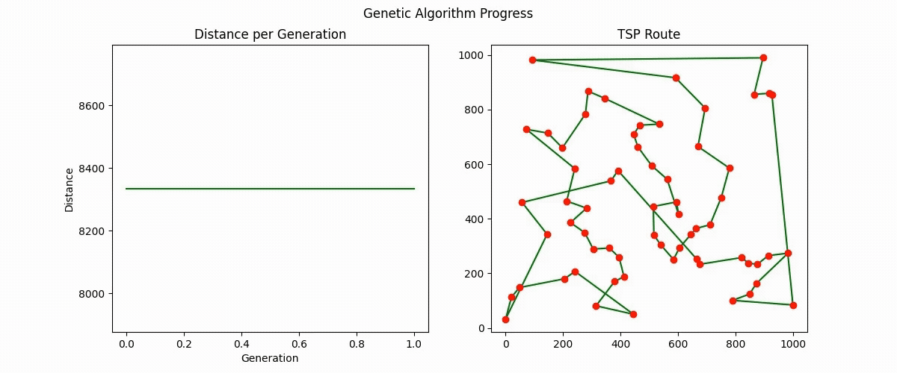
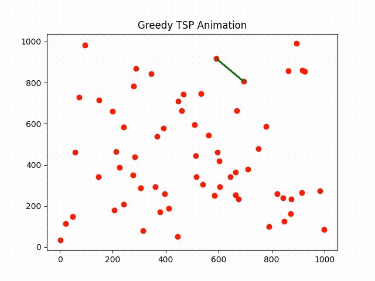
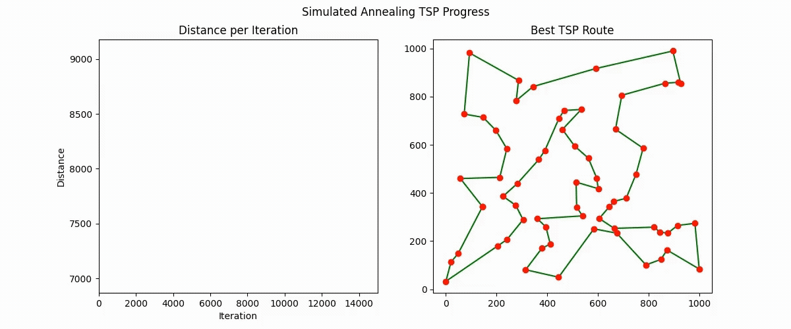

# Travelling Salesman Problem DSA

A collection of algorithms and visualizations for solving the Travelling Salesman Problem (TSP), 
implemented in Python. This repository includes Genetic Algorithm, Greedy Heuristic, and Simulated Annealing approaches, 
with sample data files and output videos demonstrating each method.

## Getting Started

### Prerequisites

  - Python 3.8 or higher
  - `ffmpeg` installed on your system (for video creation)
  - A virtual environment tool (recommended): `venv` or `virtualenv`

### Installation

  1. Clone the repository
     ```bash
     git clone https://github.com/<your-username>/Travelling_Salesman_Problem_DSA.git
     cd Travelling_Salesman_Problem_DSA
     ```

  2. Create and activate a virtual environment
     ```bash
     python3 -m venv venv
     source venv/bin/activate        # On Windows: venv\Scripts\activate
     ```

## Usage Examples

### Run Genetic Algorithm
```bash
python scripts/genetic_algorithm.py
```

### Run Greedy Heuristic
```bash
python scripts/greedy_algorithm.py
```

### Run Simulated Annealing
```bash
python scripts/simulated_annealing.py
```

## Outputs

### Genetic Algorithm

<p align="center">
  
</p>

### Greedy Algorithm

<p align="center">
  
</p>

### Simulated Annealing Algorithm

<p align="center">
  
</p>

